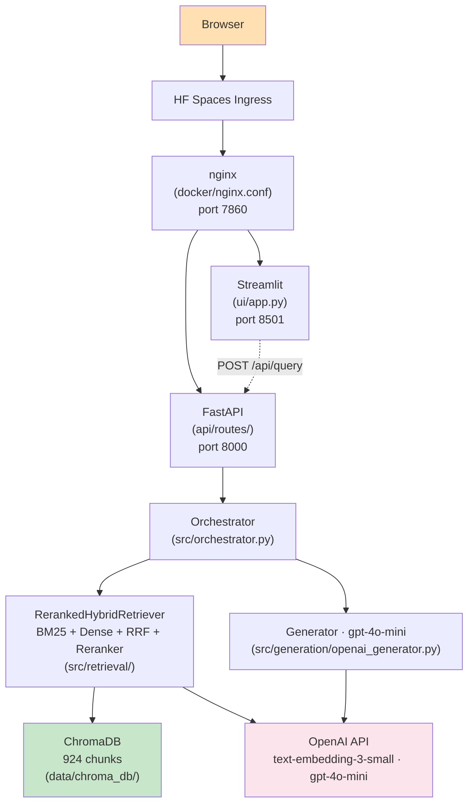

# DocuVerse

**Production-grade Retrieval-Augmented Generation over Indian government documents.**

[](https://varunbommagunta-docuverse.hf.space) [](tests/) [](https://python.org)

A complete, end-to-end RAG system over 924 chunks of real Indian government text (Constitution of India, ARC Ethics Report), with quality measured by RAGAS across five development phases and deployed as a production Docker container on Hugging Face Spaces. The engineering log documents every measurable change and honest trade-off.

**[Try it live — https://varunbommagunta-docuverse.hf.space](https://varunbommagunta-docuverse.hf.space)**
Sample question: *"What does Article 21 of the Indian Constitution protect?"*

---

## Key Results

| Metric | V1 Baseline (Phase 3a) | Phase 4 (Hybrid + Rerank) | Delta |
|--------|------------------------|---------------------------|-------|
| Faithfulness | 0.773 | 0.829 | +0.056 |
| Answer Relevance | 0.758 | 0.779 | +0.021 |
| Context Precision | 0.753 | 0.746 | -0.007 |
| Context Recall | 0.819 | 0.819 | 0.000 |

- Faithfulness and multi-fact synthesis improved measurably with hybrid retrieval + cross-encoder reranking.
- Cross-chunk queries regressed -10.7% (point-wise reranker limitation, documented in [docs/ITERATION_LOG.md](docs/ITERATION_LOG.md)).

Full eval methodology, raw JSON results, and engineering decision log in [docs/](docs/).

---

## Architecture



A modular monolith with Protocol-based components running in a single Docker container: nginx on port 7860 routes `/api/*` to FastAPI (port 8000) and everything else to Streamlit (port 8501), with supervisord managing both processes. Four swappable retrieval strategies (dense, sparse, hybrid, reranked_hybrid) are selected at startup via the `RETRIEVAL_STRATEGY` env var. ChromaDB persists the 1372-chunk index to disk. See [docs/ARCHITECTURE.md](docs/ARCHITECTURE.md) for the full breakdown.

---

## Tech Stack

- **Deployment:** Hugging Face Spaces, Docker, nginx, supervisord
- **API:** FastAPI, slowapi, Pydantic Settings
- **UI:** Streamlit
- **Retrieval:** ChromaDB, OpenAI text-embedding-3-small, rank-bm25, sentence-transformers
- **Generation:** OpenAI gpt-4o-mini with citation-forcing prompt
- **Evaluation:** RAGAS 0.4.3 with gpt-4o-mini judge
- **Quality:** 95 unit tests, structlog JSON logging

---

## Engineering Phases

- **Phase 0** — Project scaffold: Ports-and-Adapters layout, Protocol interfaces, health endpoint, Streamlit shell, Docker Compose
- **Phase 1** — Core RAG pipeline: PDF parsing, recursive chunking, OpenAI embeddings, ChromaDB vector store, cited answer generation
- **Phase 2** — Scientific evaluation: RAGAS harness, 20-question dataset, baseline scorecard on toy corpus
- **Phase 3a** — Corpus expansion: real Indian government PDFs (Constitution, ARC Ethics), 924 chunks, honest realistic baseline
- **Phase 4** — Hybrid retrieval + cross-encoder reranking: BM25 + dense RRF fusion, ms-marco reranker, +5.6 pp faithfulness
- **Phase 5** — Production hardening: rate limiting, daily cost cap, single-container HF Spaces deployment with nginx routing

Full story in [docs/ITERATION_LOG.md](docs/ITERATION_LOG.md).

---

## Roadmap

Future improvements organized by ML pipeline stage are documented in [docs/FUTURE_IMPROVEMENTS.md](docs/FUTURE_IMPROVEMENTS.md). The roadmap covers all 10 stages of the ML pipeline (parsing through evaluation) with concrete options for each, ranked by ML signal value and effort estimate.

---

## Running Locally

```bash
git clone https://github.com/varunbommagunta/docuverse.git
cd docuverse
cp .env.example .env        # add OPENAI_API_KEY=sk-...
docker compose up
```

Open http://localhost:8000 for the API and http://localhost:8501 for the UI.

---

## Honest Limitations

- HF Spaces free tier sleeps after inactivity — expect ~60s cold start
- Cross-chunk queries regressed -10.7% in Phase 4; Phase 4b planned (list-wise reranker)
- Daily INR 50 OpenAI cost cap — triggers HTTP 429 once exceeded
- 6 MB upload limit; Constitution PDF (6.65 MB) accessible via API only

---

## License

MIT
